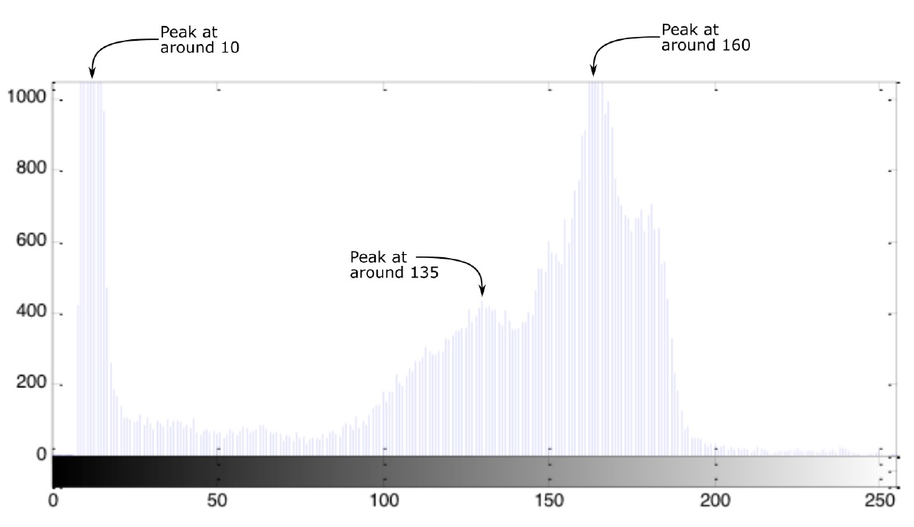
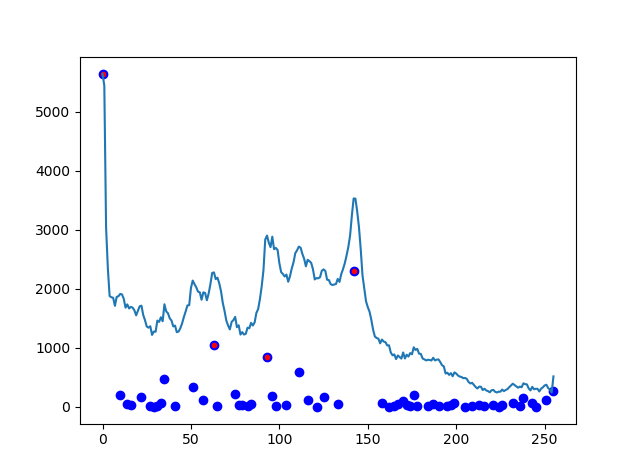

---
author:
- Yasin Yıldırım
bibliography:
- 'M335.bib'
date: July 2019
title: Technical Report
---

Introduction
============

Problem definition
------------------

For an histogram of an image like the given in
Fig.[img1-a](images/img-1.jpg), the problem is to find the dominant peaks
within the histogram as shown in
Fig.[img1-b](images/hist-1.jpg). Dominant peaks can be mixed with noise
depending on input image and its important for a proposed method to be
able to identify the dominant peaks in a robust and stable fashion.

<a href="images/img-1.jpg" target="_blank">
<figure>
  
  
   
  <figcaption>Figure 1: Input image and its histogram: 3 dominant peaks are pointed as a desired output.</figcaption>
</figure></a>

Related approaches as a solution
--------------------------------

There are different potential solutions to the given problem, for
instance **k-means** clustering or modelling components as **Gaussian
Mixture Models** (GMM). One down side of these approaches is that we
have to choose number of components, $k$, correctly. It is not possible
to form an online dominant peak detection algorithm works on real-time
by choosing $k$ manually. There are methods for choosing $k$ such as
using Silhouette score, but they require extra computational cost for
finding optimal k.

**GMM** and **k-means** are based on random initialization which makes
the solution non-deterministic [@duda2012pattern], [@bishop2006pattern].
Best practice for initialization of GMM, with the
Expectation-Maximization algorithm for instance, requires running of the
algorithm with multiple random initialization and choosing the stable
one as a final initialization. This also leads to extra computational
cost.

Algorithm
=========

High level and intuitive explanation
------------------------------------

Evaluating a histogram as a discrete valued one dimensional signal, we
can devise an algorithm by considering the 1D signal as a topological
map similar to the watershed algorithm. Starting from the highest level
of the histogram values to zero, each point visited in decreasing order
and new peaks are created or the current point assigned to left or right
neighbour's existing component depending on whether the left or right
neighbours are already visited or not. As an analogy, consider a water
level in its maximum and it is decreasing in unit degree. Each time
currently visited point constitutes a peak of an island whenever the
water level reaches a local maximum. Two islands merge together whenever
it reaches a local minimum, and higher island is assigned as a parent of
lower island in their union. More formal explanation of this approach in
terms of computational topology is given in Section
[2.2](#math_background){reference-type="ref"
reference="math_background"}.

Mathematical background {#math_background}
-----------------------

**Persistent homology** is an algebraic method for identifying
topological structures such as components, clusters or holes of data
[@edelsbrunner2010computational]. Formally, let $u_0, u_1,..., u_k$ be
points in $\mathbb{R}^d$ and *affine combination* of the $u_i$ for a
point $x$ is defined as
$x = \sum_{k}^{i=0} \lambda_i u_i \impliedby  \sum_{k}^{i=0}\lambda_i = 1$.
Set of affine combinations forms the *affine hull*. If all $\lambda_i$
are nonnegative then affine combination is a convex combination. The set
of convex combinations is called as *convex hull*.

**Simplicial complexes:** The k+1 points are affinely independent if any
two affine combinations satisfies : $x = \sum \lambda_i u_i$ and
$y = \sum \mu_i u_i,$ are the same $\iff \lambda_i = u_i$ for all $i$.
Convex hull of k+1 affinely independent points,
$\sigma=conv\{ u_0, u_1,...,u_k  \}$, forms a *k-simplex* whose
dimension is k. First three dimensional simplices, 0-simplex, 1-simplex
and 2-simplex, have special names of *vertex*, *edge* and *triangle*,
respectively. Sets of simplices having proper intersections meaning that
two simplices of K are either disjoint or intersect in a common face and
that are closed under taking faces are called *simplicial complexes*
[@edelsbrunner2010computational].

**Persistent homology:** Let K be a simplicial complex. A nested
sequence of subsets that starts with the empty complex and ends with the
complete complex forms the filtration of K as given in equation
[\[equation1\]](#equation1){reference-type="eqref"
reference="equation1"}: $$\label{equation1}
\emptyset= K_0 \subseteq K_1 \subseteq\cdots\subseteq K_n = K.$$ For a
homology class $c$ born at $K_i$ and died in $K_j$, the persistence of
$c$ is $j-i$ [@edelsbrunner2010computational],
[@edelsbrunner2008persistent].

Selecting dominant peaks with outlier detection
-----------------------------------------------

Number of dominant peak points is very small in comparison to total
histogram length. For instance, natural images mostly contains a few
dominant peaks compared to histogram length which equals to 256 for a
grayscale 8-bit image. Thus, it is possible to consider dominant peaks
as an outliers within the all **barcodes** found with the persistent
topology of a histogram. Outliers are observations that deviate
significantly from other observations of the distribution. It is easy to
perform outlier detection when assuming that the regular data come from
a known distribution, since outliers won't fit the known mathematical
model of the data. In our case, most of the barcode values are within
the low range and they lay on a linear model like a fitted line with
fixed margin. However, dominant peaks have much higher barcode values in
which they don't fit the other observations, like outliers. The example
histogram and found barcodes are shown in
[img2](images/Figure_2.png), in
which barcode values are displayed with red points and weak barcode
values are colored blue.

<a href="images/Figure_2.png" target="_blank">
<figure>
  
   
  <figcaption>Figure 2: Red channel histogram of a sample image: Accepted dominant peaks are
shown as red points wheres the rejected peak candidates are shown as
blue points.</figcaption>
</figure></a>

The median is a robust statistic that it is not influenced by outliers.
**Median Absolute Deviation** (MAD) is used in order to detect outliers.
Formally, for each barcode values $b_i$, distance to the median is
calculated and MAD is chosen from the median of these deviations, as
shown in equation [\[equation2\]](#equation2){reference-type="eqref"
reference="equation2"}:

$$\label{equation2}
     MAD = median\{ \left | b_i - \tilde{b}  \right | \}$$

where $\tilde{b}$ denotes median of the barcodes. Then, MAD based
z-scores are calculated for each barcode as in the equation
[\[equation3\]](#equation3){reference-type="eqref"
reference="equation3"}:

$$\label{equation3}
     m_i = k* \frac{ \left | b_i - \tilde{b}  \right | }{MAD}$$

where $m_i$, $k$ are the MAD based z-score of barcode $b_i$ and quartile
coefficient respectively. Finally, dominant peaks are chosen such that
only the peaks with the certain z-scores that are higher than the
cut-off values are accepted. Formally, each barcode $b_i$ is accepted as
peak $p_i$ if $m_i > T$, for the given cut-off threshold $T$.

Implementation
==============

Implementation is done in C++ language. *Libbmp* library
[@dickmannbitmap] is used for input and output operations in bitmap
files, which is used in the driver program (*main.cpp*). CMake is used
as a build tool in the project.

Building the project
--------------------

**Requirements:** Project is built and tested on Windows with MSVC++
compiler with c++17 language standard enabled. A C++ compiler with
minimum c++11 features is required to build the project. CMake is
required in order to build the project seamlessly. Since the project is
tiny, it is also possible to easily build the project manually using
compiler commands such as gcc and clang.

    cd hist-peaks
    mkdir build
    cd build
    cmake ..

For Windows, it generates Visual Studio solution file and it can be
directly built and run from Visual Studio. For Linux or MacOS, project
can be built with *Make* by typing the following command inside build
directory:

    make

Running the project
-------------------

*hist-peaks.exe* executable file should be generated after building the
project (Tested on Windows only). The driver program accepts bitmap file
path as an input. In order to run the program type the following:

    hist-peaks.exe <input-bitmap-file>

If no input file is provided, the default image path, which is
*'data/test1.bmp'*, is used.
